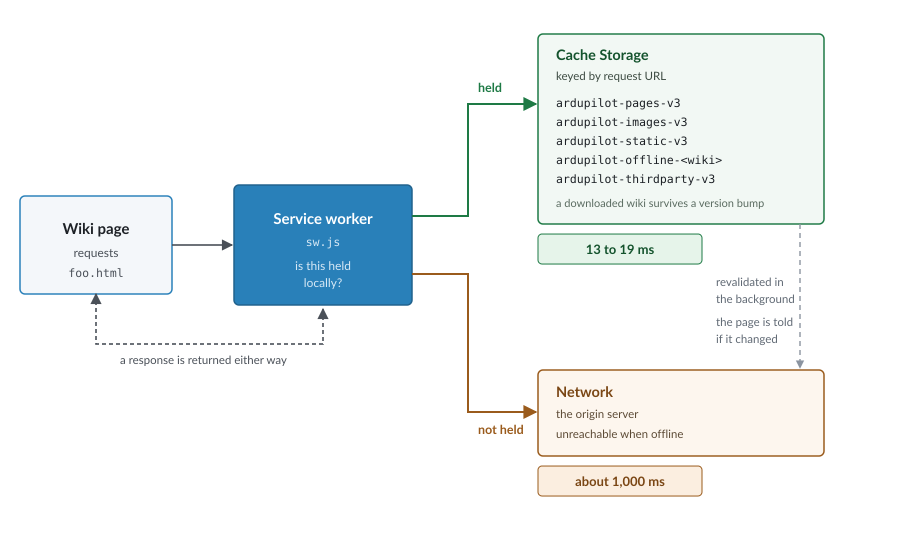
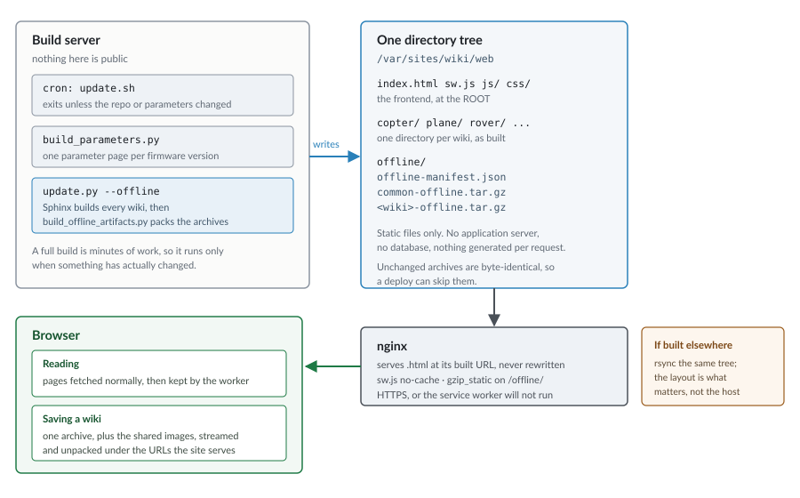

.. _wiki-offline-copies:

=======================
How Offline Copies Work
=======================

The wiki can be read without a connection, and is noticeably faster to browse
with one. This page covers what the feature does, how to get the most from it,
and, further down, how it is built.

For the download controls themselves, see :ref:`common-offline`.

Features
========

Three, and they are easily confused with one another:

**Faster browsing, with nothing asked of you.** Pages you visit are kept on the
device and served from there next time. No decision, no setup, and it applies
from your second visit onward.

**Saving a wiki for offline use.** The one part that costs real bandwidth, and
always a deliberate choice. It fetches the wiki you pick plus the shared image
set, which is needed whichever wiki you choose and is much the larger of the
two. Afterwards every page in that wiki opens with no connection at all.

**Exporting the wiki as a single file.** One ``.html`` holding the pages, the
images and a full text search index. Double-click to open it, nothing to
install, and it runs from a USB stick. For a machine you cannot install
software on, or for handing the documentation to someone on a memory card.

Using it well
=============

**Save the wiki for the vehicle you actually work on.** The shared images are
the bulk of the download and are needed regardless, so the first save is the
expensive one. A second wiki afterwards costs only its own pages.

**Save before you need it.** Saving requires a connection. In the workshop it
is a minute; in the field it is not possible.

**Install the site as an app if you rely on it.** This downloads nothing by
itself. It makes the browser far less likely to reclaim the saved data when the
device runs short of space, which is a real risk with several hundred
megabytes.

**Check for updates deliberately.** Saved pages do not update themselves. The
page reports whether what is stored still matches what has been published.

**Clearing site data removes it.** A saved wiki lives in the browser's storage
for this site, so clearing that data means saving it again.

Speed
=====

The same mechanism makes ordinary browsing faster, whether or not anything has
been saved and whether or not there is a connection. Once a page or asset is
held locally it comes from storage, so navigation does not wait on the network.

Measured on the same pages, none of them visited earlier in the session:

=================================  =================  ==============
\                                  Over the network   Held locally
=================================  =================  ==============
Page HTML                          about 1,000 ms     13 to 19 ms
Theme assets (jQuery, CSS, fonts)  fetched each time  1 to 2 ms
Network requests per navigation    28                 0
The full parameter list (6.2 MB)   about 3,000 ms     served locally
Reading with no connection         nothing loads      unchanged
=================================  =================  ==============

Most readers will notice this rather than the offline capability, since it
applies on every visit rather than only when travelling.

Implementation
==============

Everything below this point describes how the feature is built, and is aimed at
anyone changing it or reviewing changes to it. It is not needed in order to use
the wiki offline.

The service worker
------------------

A service worker is a script the browser runs in the background, independently
of any page and persisting after the page that registered it closes. Once
active it sits between the pages in its scope and the network: every request
those pages make is passed to it, and it answers either from local storage or
by forwarding the request onward.

That interception is the whole mechanism. The pages are unmodified static HTML
as built by Sphinx; nothing is rewritten and no framework is introduced.

Implementation is in ``frontend/sw.js``, registered by ``frontend/js/pwa.js``,
which ``common/_templates/layout.html`` includes on every page.

.. note::

   Service workers require a secure context: ``https://``, or
   ``http://localhost`` for development. A wiki served over plain HTTP has no
   offline support at all.

Storage
-------

Cache Storage holds complete HTTP responses keyed by request URL, in named
stores. It is separate from the browser's HTTP cache, is not cleared with
browsing history, and is scoped to the origin.

``ardupilot-pages-v3``, ``-images-v3``, ``-static-v3``
   Populated while browsing. Discarded when ``CACHE_VERSION`` changes.

``ardupilot-offline-<wiki>``
   A saved wiki. Excluded from version-bump deletion, since it holds content
   the reader chose to store.

``ardupilot-thirdparty-v3``
   Cross-origin assets, so they are not re-fetched on every page.

``heldOffline()`` in ``sw.js`` decides whether a URL is held. It serves every
resource type, and tries each form a URL may have been stored under, including
the ``/_common/`` path used for images shared between wikis.

.. note::

   Stored keys are the URLs the site serves. ArduPilot serves
   ``/copter/docs/foo.html`` directly. A host that canonicalises URLs, by
   stripping ``.html`` for instance, breaks offline reading while leaving
   online browsing unaffected, which makes it a difficult fault to attribute.

Why browsing is fast
--------------------

**Local content is preferred over the network.** A page held locally is
returned at once and revalidated behind; if the fetched copy differs, the page
is told and offers a reload.

**Lookups are directed rather than exhaustive.** ``caches.match()`` without a
store name searches every store in turn, and a reader with every wiki saved has
fourteen. The URL identifies the single store that can hold it: 692 ms against
89 ms for the same request. The exhaustive search remains as a fallback.

**Content found in a saved wiki is promoted** into the runtime store, so later
requests resolve directly: 84 ms against 1 ms.

**Fingerprinted assets are cache-first.** Sphinx stamps them
(``theme.css?v=5d32c60e``), so a stored copy can only be the copy that
fingerprint names.

Prefetching
-----------

``pwa.js`` fetches a page shortly before it is likely to be wanted, from
pointer position, velocity projected forward, and whether the pointer is
decelerating as it nears a link. A pointer crossing a link at speed triggers
nothing.

Speculative traffic is bounded: at most eight per page view, at least 400 ms
apart, one in flight, each URL once, anything over 2 MB abandoned, and
in-flight requests cancelled on navigation. Pages already held bypass the
budget, generating no traffic. Nothing is fetched when the reader has asked for
reduced data usage, or on pages carrying more than 250 links, where the links
are an index rather than a sign of intent.

Saving a wiki
-------------

Fetching pages one at a time would be roughly 3,400 requests per reader for
Copter. Each wiki is packed at build time instead, and unpacked by the browser.

``common_offline_page.js`` streams the archive and unpacks entries as they
arrive rather than buffering the file. Each entry is written to Cache Storage
under the URL the site serves it at, so saved content is retrieved by the same
path as content kept while browsing.

Two constraints apply:

* Archives are served with a content coding, so the browser decompresses them
  before the script sees the body. This avoids requiring
  ``DecompressionStream``, absent in Safari before 16.4 and Firefox before 113.
* A completion marker is written last, and a saved wiki counts as usable only
  once it exists, so an interrupted download is never mistaken for a complete
  one.

Building and serving
====================

``scripts/build_offline_artifacts.py`` runs during a build when ``--offline``
is passed, writing into ``<destdir>/offline/``:

``offline-manifest.json``
   Sizes, page counts and a build id. The download page renders from this
   rather than hardcoding figures.

``common-offline.tar.gz``
   Images used by two or more wikis. The majority of the total size, kept
   separate because including them per wiki would multiply several hundred
   megabytes across eleven.

``<wiki>-offline.tar.gz``
   Content unique to a single wiki.

Archives are reproducible: tar metadata is normalised, so unchanged content
produces byte-identical output and a deploy can skip it.

Requirements
------------

The archives are static files. No application server or database is involved.

**Serve pages at their built URLs.** ``/copter/docs/foo.html`` must return that
page, not a redirect to ``/copter/docs/foo``.

**Do not cache the worker.** ``/sw.js`` must be served
``Cache-Control: no-cache``.

**Pair archives with their compressed form.** Under nginx, ``gzip_static on``
in the ``/offline/`` location serves ``<name>.tar.gz`` for ``<name>.tar`` and
sets the content coding.

**Serve the frontend at the web root.** A worker's scope is its own path and
below, so a worker at ``/frontend/sw.js`` registers successfully and controls
no wiki page.

``deploy/nginx-wiki.conf`` is a working configuration.

Recovery
--------

This is a worst case, and is described because it is the one failure a reader
cannot clear themselves.

A service worker outlives the page that registered it and controls every page
in its scope, so a faulty one is not resolved by reloading, by navigating
elsewhere on the site, or usually by restarting the browser. A worker serving
wrong or stale content will keep doing so.

``frontend/sw-kill.js`` exists for that case. Deployed in place of ``sw.js``,
it unregisters the worker and deletes its caches on every device that fetches
it, returning readers to an ordinary website. It is a one-line deploy and asks
nothing of readers.

This works only if the browser will collect the replacement, which is why
``/sw.js`` must be served ``no-cache``. That header is not a nicety: without
it there is no remote means of recovery.

Testing
-------

.. code-block:: bash

    npm install --no-save jsdom
    npm test

``scripts/tests/test_offline_worker.js``
   Builds a cache from real archives, requests the URLs the site serves, and
   resolves them with the worker's own code.

``scripts/tests/test_offline_page.js``
   Drives the download panel under jsdom, including the update check.

``scripts/tests/test_offline_export.js``
   Runs the exporter against build output and inspects the result.

``scripts/tests/test_offline_archives.py``
   Inspects the finished archives. Requires ``update.py --offline`` first.

Tests exercise the shipped code rather than a reimplementation of it, and each
must be shown to fail when the behaviour it covers is removed.

Limitations
===========

* The shared image set is required whichever wiki is chosen, so the first save
  is large before anything is readable offline.
* The generated reference pages, such as the full parameter lists and the board
  feature tables, reach several megabytes and hundreds of thousands of
  elements. Their cost is in rendering rather than transfer, so caching does
  not help them.
* EPUB and PDF output are not covered by this feature.
